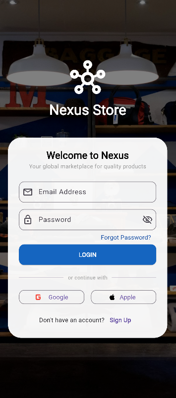
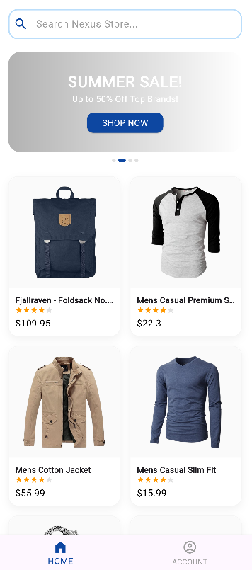
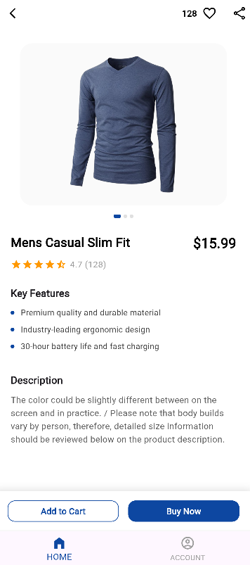

# Nexus Store 🛒

Nexus Store, modern ve şık bir arayüze sahip, kullanıcı dostu bir "Mini Katalog Uygulaması"dır. Bu proje, Flutter eğitim serisi kapsamında temel widget yapısı, sayfa geçişleri ve API entegrasyonu konularını uygulamak amacıyla geliştirilmiştir.

## 🚀 Proje Özellikleri

- **Modern Giriş Ekranı:** Şık bir arka plan ve kullanıcı odaklı giriş formu.
- **Dinamik Ürün Listeleme:** FakeStoreAPI kullanılarak gerçek zamanlı veri çekimi ve GridView ile sergileme.
- **Gelişmiş Ürün Detayı:** Ürün görselleri, teknik özellikler ve etkileşimli öğeler.
- **Beğeni Sistemi:** Ürün detay sayfasında dinamik state yönetimi ile çalışan beğeni butonu.
- **Modern Navigasyon:** Sayfalar arası akıcı geçişler ve Route Arguments ile veri aktarımı.

## 🛠️ Kullanılan Teknolojiler

- **Flutter:** 3.x (En güncel sürümle uyumlu)
- **Dart:** Tip güvenli programlama dili.
- **HTTP:** REST API entegrasyonu için.
- **Material Design 3:** Modern UI bileşenleri.

## 📸 Ekran Görüntüleri

|         Giriş Ekranı          |         Ürün Listesi          |          Ürün Detayı          |
| :---------------------------: | :---------------------------: | :---------------------------: |
|  |  |  |

_(Not: Ekran görüntülerini eklemek için assets/screenshots klasörüne yükleyip yolları güncelleyebilirsiniz.)_

## 🏁 Çalıştırma Adımları

Bu projeyi yerel makinenizde çalıştırmak için aşağıdaki adımları izleyin:

1. **Depoyu klonlayın:**
   ```bash
   git clone [https://github.com/kullaniciadi/nexus_store.git](https://github.com/kullaniciadi/nexus_store.git)
   ```
